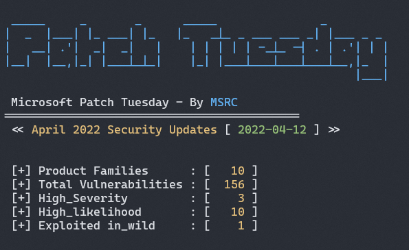
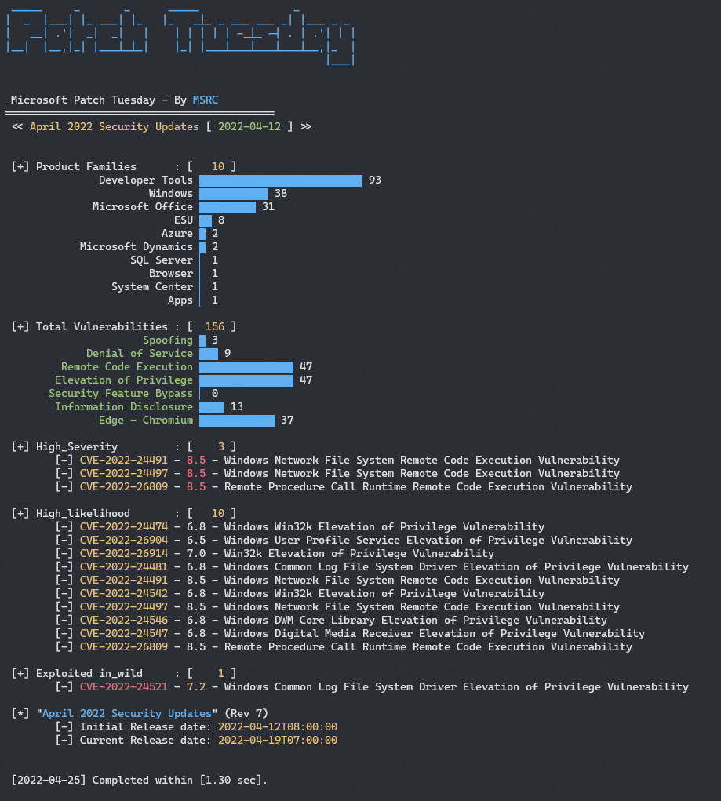
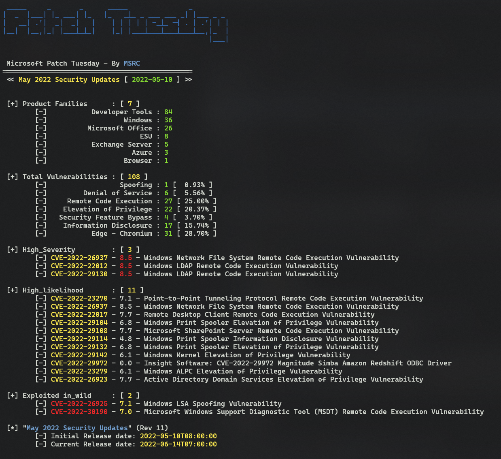
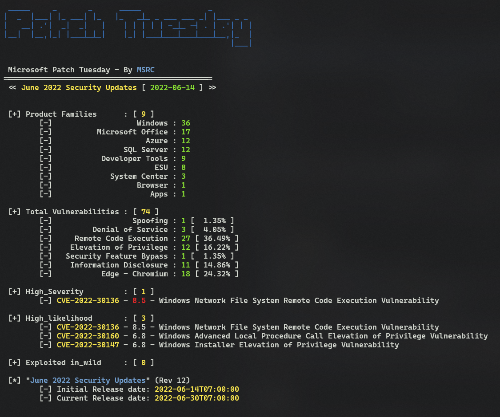

# MS Patch Tuesday 

`MS Patch Tuesday` is the second Tuesday of every month when Microsoft releases security updates to fix vulnerabilities in their software products.

This is a simple script, written in Python, to perform quick analysis on security updates. 
It quickly summarizes:

 - Monthly MS patched product families.
 - Monthly security updates.
 - Any ***high severity*** vulnerabilities (CVSS >= 8.5).
 - Any ***high likelihood*** vulnerabilities (contains 'Exploitation More Likely')
 - Any vulnerability that ***exploited in wild*** (Exploited:yes)

Microsoft Security Response Center (MSRC) investigates all reports of security vulnerabilities affecting Microsoft products and services, and provides these updates as part of the ongoing effort to help you manage security risks and help keep your systems protected. 

All the details from Microsoft security update are formatted according to the Common Vulnerability Reporting Framework (CVRF). 
For more details, please visit [msrc.microsoft.com/update-guide](https://msrc.microsoft.com/update-guide).

> ***CVRF*** *stands for `Common Vulnerability Reporting Framework`.*

<!--
# Usages
Get quick summary of MS vulnerability stats for current month. 
```console
$ ./patch_tuesday.py
```


## Tips
Show quick summary with simple ASCII chart.
```console
$ ./patch_tuesday.py -vc -k 2022-apr
```


```console
$ ./patch_tuesday -k 2022-may -v
```


```console
$ ./patch_tuesday -k 2022-jun -v
```


-->

# Feature

<!-- show the help screen -->

## Usages

<!-- show a few usages -->

# History/Updates:

 - 2022.03 : ms_patch_tuesday_2.0
 - 2024.04 : ms_patch_tuesday_3.0

## CVRF API calls
 
 - https://api.msrc.microsoft.com/cvrf/v3.0/cvrf/
 - https://api.msrc.microsoft.com/cvrf/v2.0/cvrf/

# Links:

 - [MSRC-Microsoft-Security-Updates-API](https://github.com/microsoft/MSRC-Microsoft-Security-Updates-API)
 - [MSRC CVRF API v3](https://api.msrc.microsoft.com/cvrf/v3.0/swagger/v3/swagger.json)
 - [MySeq - Patch_Tuesday Utils](https://myseq.blogspot.com/2022/07/patchtuesday-utils.html)


