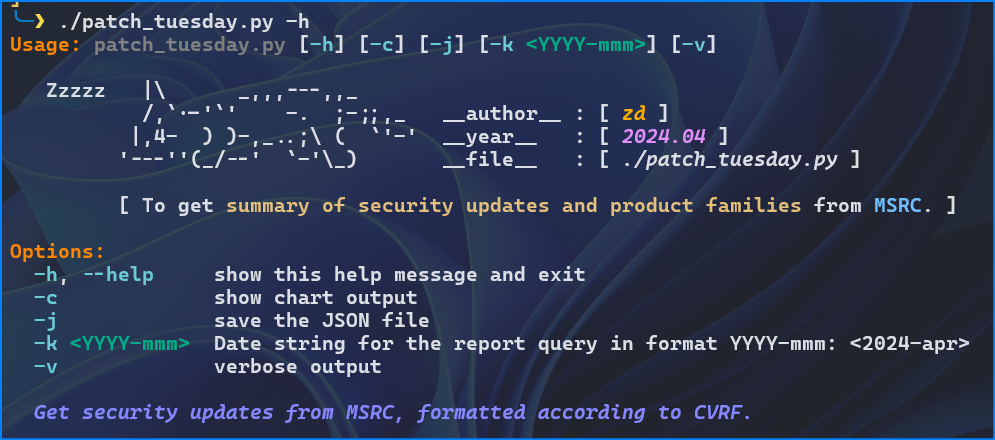

# MS Patch Tuesday 

`MS Patch Tuesday` is the second Tuesday of every month when Microsoft releases security updates to fix vulnerabilities in their software products.

This is a simple script, written in Python, to perform quick analysis on security updates. 
It quickly summarizes:

 - Monthly security updates.
   - Any ***high severity*** vulnerabilities (CVSSi_Base >= 8.5).
   - Any ***high likelihood*** vulnerabilities (contains 'Exploitation More Likely')
   - Any vulnerability that ***exploited in wild*** (Exploited:yes)
 - Monthly MS patched product families.

Microsoft Security Response Center (MSRC) investigates all reports of security vulnerabilities affecting Microsoft products and services, and provides these updates as part of the ongoing effort to help you manage security risks and help keep your systems protected. 

All the details from Microsoft security update are formatted according to the Common Vulnerability Reporting Framework (CVRF). 
For more details, please visit [msrc.microsoft.com/update-guide](https://msrc.microsoft.com/update-guide).

> ***CVRF*** *stands for `Common Vulnerability Reporting Framework`.*

## Setup (Installation)

```bash
$ git clone https://github.com/myseq/ms_patch_tuesday.git
$ cd ms_patch_tuesday
$ python3 -m venv .venv
$ source .venv/bin/activate 
$ pip3 install -r requirements.txt
$ ./patch_tuesday.py -h
$
$ deactivate
```



## Features

 1. Show the total vulnerability count for the month.
 1. Show the number of `high severity` vulnerability count.
 1. Show the number of vulnerability which `very likely to be exploited`. 
 1. Show the number of vulnerability which already `exploited in wild`.
 1. Show the `product families` that involve.
 1. Display the product familier as `bar chart`.
 1. Download the `JSON` file.

## Usages

Show quick summary including `Action_required` and CISA_KEV count.

```bash
$ ./patch_tuesday.py

 _____     _       _      _____               _
|  _  |___| |_ ___| |_   |_   _|_ _ ___ ___ _| |___ _ _
|   __| .'|  _|  _|   |    | | | | | -_|_ -| . | .'| | |
|__|  |__,|_| |___|_|_|    |_| |___|___|___|___|__,|_  |
                                                   |___|

 Microsoft Patch Tuesday - By MSRC
===============================================
 << August 2024 Security Updates [ 2024-08-13 ] >>


 [+] Vulnerabilities           : [ 102 ]
        [-] High_Severity      : [  21 ]
        [-] High_likelihood    : [  11 ]
        [-] Exploited in_wild  : [   6 ]
        [-] Action_required    : [  99 ]
        [-] Found in CISA_KEV  : [   6 ]


 [*] [2024-08-19] main(): Completed within [8.9630 sec].

```

Show vulnerabilities and product families in verbose mode.

```bash
$ ./patch_tuesday.py -v -k 2024-may


 _____     _       _      _____               _
|  _  |___| |_ ___| |_   |_   _|_ _ ___ ___ _| |___ _ _
|   __| .'|  _|  _|   |    | | | | | -_|_ -| . | .'| | |
|__|  |__,|_| |___|_|_|    |_| |___|___|___|___|__,|_  |
                                                   |___|


 [*] Finish fetching [1,215,882 bytes] from https://api.msrc.microsoft.com/cvrf/v3.0/cvrf/2024-may


 [*] CISA Catalog of Known Exploited Vulnerabilities [ 2024.08.15/1150 ]


 Microsoft Patch Tuesday - By MSRC
===============================================
 << May 2024 Security Updates [ 2024-05-14 ] >>


 [+] Vulnerabilities           : [  79 ]
        [-] High_Severity      : [   7 ]
        [-] High_likelihood    : [  10 ]
        [-] Exploited in_wild  : [   2 ]
        [-] Action_required    : [  79 ]
        [-] Found in CISA_KEV  : [   6 ]

                                                           High_Severity/7
┏━━━━━━━━━━━━━━━━┳━━━━━━━━━━━━━━━━━┳━━━━━━━━━━━━━━━━━━━━━━━━━━━━━━━━━━━━━━━━━━━━━━━━━━━━━━━━━━━━━━━━━━━━━━━━━━━━━━━━━━━━━━━━━━━━━━━━━┓
┃ CVE            ┃ CVSS_Base/Temp  ┃ Title_Value                                                                                     ┃
┡━━━━━━━━━━━━━━━━╇━━━━━━━━━━━━━━━━━╇━━━━━━━━━━━━━━━━━━━━━━━━━━━━━━━━━━━━━━━━━━━━━━━━━━━━━━━━━━━━━━━━━━━━━━━━━━━━━━━━━━━━━━━━━━━━━━━━━┩
│ CVE-2024-32002 │   B:9.0/T:7.8   │ GitHub:  CVE-2024-32002 Recursive clones on case-insensitive filesystems that support symlinks  │
│                │                 │ are susceptible to Remote Code Execution                                                        │
│ CVE-2024-30006 │   B:8.8/T:7.7   │ Microsoft WDAC OLE DB provider for SQL Server Remote Code Execution Vulnerability               │
│ CVE-2024-30007 │   B:8.8/T:7.7   │ Microsoft Brokering File System Elevation of Privilege Vulnerability                            │
│ CVE-2024-30009 │   B:8.8/T:7.7   │ Windows Routing and Remote Access Service (RRAS) Remote Code Execution Vulnerability            │
│ CVE-2024-30010 │   B:8.8/T:7.7   │ Windows Hyper-V Remote Code Execution Vulnerability                                             │
│ CVE-2024-30017 │   B:8.8/T:7.7   │ Windows Hyper-V Remote Code Execution Vulnerability                                             │
│ CVE-2024-30040 │ B:8.8/T:8.2 [K] │ Windows MSHTML Platform Security Feature Bypass Vulnerability                                   │
└────────────────┴─────────────────┴─────────────────────────────────────────────────────────────────────────────────────────────────┘

                                               High_Likelihood/10
┏━━━━━━━━━━━━━━━━┳━━━━━━━━━━━━━━━━┳━━━━━━━━━━━━━━━━━━━━━━━━━━━━━━━━━━━━━━━━━━━━━━━━━━━━━━━━━━━━━━━━━━━━━━━━━━━━━┓
┃ CVE            ┃ CVSS_Base/Temp ┃ Title_Value                                                                 ┃
┡━━━━━━━━━━━━━━━━╇━━━━━━━━━━━━━━━━╇━━━━━━━━━━━━━━━━━━━━━━━━━━━━━━━━━━━━━━━━━━━━━━━━━━━━━━━━━━━━━━━━━━━━━━━━━━━━━┩
│ CVE-2024-29996 │  B:7.8/T:6.8   │ Windows Common Log File System Driver Elevation of Privilege Vulnerability  │
│ CVE-2024-30044 │  B:7.2/T:6.3   │ Microsoft SharePoint Server Remote Code Execution Vulnerability             │
│ CVE-2024-30050 │  B:5.4/T:5.0   │ Windows Mark of the Web Security Feature Bypass Vulnerability               │
│ CVE-2024-30025 │  B:7.8/T:6.8   │ Windows Common Log File System Driver Elevation of Privilege Vulnerability  │
│ CVE-2024-30032 │  B:7.8/T:6.8   │ Windows DWM Core Library Elevation of Privilege Vulnerability               │
│ CVE-2024-30034 │  B:5.5/T:4.8   │ Windows Cloud Files Mini Filter Driver Information Disclosure Vulnerability │
│ CVE-2024-30035 │  B:7.8/T:6.8   │ Windows DWM Core Library Elevation of Privilege Vulnerability               │
│ CVE-2024-30037 │  B:5.5/T:4.8   │ Windows Common Log File System Driver Elevation of Privilege Vulnerability  │
│ CVE-2024-30038 │  B:7.8/T:6.8   │ Win32k Elevation of Privilege Vulnerability                                 │
│ CVE-2024-30049 │  B:7.8/T:6.8   │ Windows Win32 Kernel Subsystem Elevation of Privilege Vulnerability         │
└────────────────┴────────────────┴─────────────────────────────────────────────────────────────────────────────┘

                                        Exploited_in_Wild/2
┏━━━━━━━━━━━━━━━━┳━━━━━━━━━━━━━━━━━┳━━━━━━━━━━━━━━━━━━━━━━━━━━━━━━━━━━━━━━━━━━━━━━━━━━━━━━━━━━━━━━━┓
┃ CVE            ┃ CVSS_Base/Temp  ┃ Title_Value                                                   ┃
┡━━━━━━━━━━━━━━━━╇━━━━━━━━━━━━━━━━━╇━━━━━━━━━━━━━━━━━━━━━━━━━━━━━━━━━━━━━━━━━━━━━━━━━━━━━━━━━━━━━━━┩
│ CVE-2024-30040 │ B:8.8/T:8.2 [K] │ Windows MSHTML Platform Security Feature Bypass Vulnerability │
│ CVE-2024-30051 │ B:7.8/T:7.2 [K] │ Windows DWM Core Library Elevation of Privilege Vulnerability │
└────────────────┴─────────────────┴───────────────────────────────────────────────────────────────┘


 [+] Product Families (10)
        [ 1]              Windows : 26
        [ 2]     Microsoft Office : 13
        [ 3]                  ESU : 10
        [ 4]      Developer Tools : 9
        [ 5]                Azure : 2
        [ 6]                 Apps : 2
        [ 7]              Mariner : 2
        [ 8]              Browser : 1
        [ 9]   Microsoft Dynamics : 1
        [10]           SQL Server : 1

 [*] "May 2024 Security Updates" (Rev 25)
        [-] Initial Release date: 2024-05-14T07:00:00
        [-] Current Release date: 2024-06-19T07:00:00


 [*] [2024-08-19] main(): Completed within [4.8891 sec].

```

Show vulnerabilities and product families (as bar chart) in verbose mode.

```bash
$ ./patch_tuesday.py -vc -k 2024-jun

 _____     _       _      _____               _
|  _  |___| |_ ___| |_   |_   _|_ _ ___ ___ _| |___ _ _
|   __| .'|  _|  _|   |    | | | | | -_|_ -| . | .'| | |
|__|  |__,|_| |___|_|_|    |_| |___|___|___|___|__,|_  |
                                                   |___|


 [*] Finish fetching [3,472,243 bytes] from https://api.msrc.microsoft.com/cvrf/v3.0/cvrf/2024-jun


 [*] CISA Catalog of Known Exploited Vulnerabilities [ 2024.08.15/1150 ]


 Microsoft Patch Tuesday - By MSRC
===============================================
 << June 2024 Security Updates [ 2024-06-11 ] >>


 [+] Vulnerabilities           : [  91 ]
        [-] High_Severity      : [   7 ]
        [-] High_likelihood    : [  12 ]
        [-] Exploited in_wild  : [   0 ]
        [-] Action_required    : [  90 ]
        [-] Found in CISA_KEV  : [   0 ]

                                                          High_Severity/7
┏━━━━━━━━━━━━━━━━┳━━━━━━━━━━━━━━━━┳━━━━━━━━━━━━━━━━━━━━━━━━━━━━━━━━━━━━━━━━━━━━━━━━━━━━━━━━━━━━━━━━━━━━━━━━━━━━━━━━━━━━━━━━━━━━━━━┓
┃ CVE            ┃ CVSS_Base/Temp ┃ Title_Value                                                                                   ┃
┡━━━━━━━━━━━━━━━━╇━━━━━━━━━━━━━━━━╇━━━━━━━━━━━━━━━━━━━━━━━━━━━━━━━━━━━━━━━━━━━━━━━━━━━━━━━━━━━━━━━━━━━━━━━━━━━━━━━━━━━━━━━━━━━━━━━┩
│ CVE-2024-30078 │  B:8.8/T:7.7   │ Windows Wi-Fi Driver Remote Code Execution Vulnerability                                      │
│ CVE-2024-30080 │  B:9.8/T:8.5   │ Microsoft Message Queuing (MSMQ) Remote Code Execution Vulnerability                          │
│ CVE-2024-30064 │  B:8.8/T:7.7   │ Windows Kernel Elevation of Privilege Vulnerability                                           │
│ CVE-2024-30068 │  B:8.8/T:7.7   │ Windows Kernel Elevation of Privilege Vulnerability                                           │
│ CVE-2024-30097 │  B:8.8/T:7.7   │ Microsoft Speech Application Programming Interface (SAPI) Remote Code Execution Vulnerability │
│ CVE-2024-30103 │  B:8.8/T:7.7   │ Microsoft Outlook Remote Code Execution Vulnerability                                         │
│ CVE-2024-35249 │  B:8.8/T:7.7   │ Microsoft Dynamics 365 Business Central Remote Code Execution Vulnerability                   │
└────────────────┴────────────────┴───────────────────────────────────────────────────────────────────────────────────────────────┘

                                               High_Likelihood/12
┏━━━━━━━━━━━━━━━━┳━━━━━━━━━━━━━━━━┳━━━━━━━━━━━━━━━━━━━━━━━━━━━━━━━━━━━━━━━━━━━━━━━━━━━━━━━━━━━━━━━━━━━━━━━━━━━━━┓
┃ CVE            ┃ CVSS_Base/Temp ┃ Title_Value                                                                 ┃
┡━━━━━━━━━━━━━━━━╇━━━━━━━━━━━━━━━━╇━━━━━━━━━━━━━━━━━━━━━━━━━━━━━━━━━━━━━━━━━━━━━━━━━━━━━━━━━━━━━━━━━━━━━━━━━━━━━┩
│ CVE-2024-30080 │  B:9.8/T:8.5   │ Microsoft Message Queuing (MSMQ) Remote Code Execution Vulnerability        │
│ CVE-2024-30082 │  B:7.8/T:6.8   │ Win32k Elevation of Privilege Vulnerability                                 │
│ CVE-2024-35250 │  B:7.8/T:6.8   │ Windows Kernel-Mode Driver Elevation of Privilege Vulnerability             │
│ CVE-2024-35260 │  B:8.0/T:7.0   │ Microsoft Dataverse Remote Code Execution Vulnerability                     │
│ CVE-2024-30084 │  B:7.0/T:6.1   │ Windows Kernel-Mode Driver Elevation of Privilege Vulnerability             │
│ CVE-2024-30085 │  B:7.8/T:7.0   │ Windows Cloud Files Mini Filter Driver Elevation of Privilege Vulnerability │
│ CVE-2024-30086 │  B:7.8/T:6.8   │ Windows Win32 Kernel Subsystem Elevation of Privilege Vulnerability         │
│ CVE-2024-30087 │  B:7.8/T:6.8   │ Win32k Elevation of Privilege Vulnerability                                 │
│ CVE-2024-30088 │  B:7.0/T:6.3   │ Windows Kernel Elevation of Privilege Vulnerability                         │
│ CVE-2024-30089 │  B:7.8/T:6.8   │ Microsoft Streaming Service Elevation of Privilege Vulnerability            │
│ CVE-2024-30091 │  B:7.8/T:7.0   │ Win32k Elevation of Privilege Vulnerability                                 │
│ CVE-2024-30099 │  B:7.0/T:6.3   │ Windows Kernel Elevation of Privilege Vulnerability                         │
└────────────────┴────────────────┴─────────────────────────────────────────────────────────────────────────────┘


 [+] Product Families (8)
                       Windows ▇▇▇▇▇▇▇▇▇▇▇▇▇▇▇ 26
                         Azure ▇▇▇▇▇▇▇▇▇ 15
              Microsoft Office ▇▇▇▇▇▇▇▇ 13
                           ESU ▇▇▇▇▇▇ 10
               Developer Tools ▇▇▇▇ 6
                       Mariner ▇▇▇▇ 6
            Microsoft Dynamics ▇▇▇ 5
                       Browser ▇▇ 3

 [*] "June 2024 Security Updates" (Rev 181)
        [-] Initial Release date: 2024-06-11T07:00:00
        [-] Current Release date: 2024-08-13T07:00:00


 [*] [2024-08-19] main(): Completed within [10.2520 sec].

```

Download and save the JSON file (YYYY_MM.json).

```bash
$ ./patch_tuesday.py -j -k 2023-dec

 _____     _       _      _____               _
|  _  |___| |_ ___| |_   |_   _|_ _ ___ ___ _| |___ _ _
|   __| .'|  _|  _|   |    | | | | | -_|_ -| . | .'| | |
|__|  |__,|_| |___|_|_|    |_| |___|___|___|___|__,|_  |
                                                   |___|

ic| filename: '2023_12.json'


 [*] [2024-04-23] main(): Completed within [3.0585 sec].

```

## Tips

Use the `-j` option to download the JSON file.
Then use `jq` utility to count the number of vulnerabilities released.

```bash
$ cat 2023_12.json | jq '.Vulnerability | length'
51
```

# History/Updates:

 - 2022.03 : ms_patch_tuesday_2.0
 - 2024.04 : ms_patch_tuesday_3.0
 - 2022.07 : ms_patch_tuesday_3.1 (minor bug fix)
 - 2024.08 : ms_patch_tuesday.4.0 (added CISA_KEV, action_required)

## CVRF API calls
 
 - https://api.msrc.microsoft.com/cvrf/v3.0/cvrf/
 - https://api.msrc.microsoft.com/cvrf/v2.0/cvrf/

# Links:

 - [MSRC-Microsoft-Security-Updates-API](https://github.com/microsoft/MSRC-Microsoft-Security-Updates-API)
 - [MSRC CVRF API v3](https://api.msrc.microsoft.com/cvrf/v3.0/swagger/v3/swagger.json)
 - [MySeq - Patch_Tuesday Utils](https://myseq.blogspot.com/2022/07/patchtuesday-utils.html)


